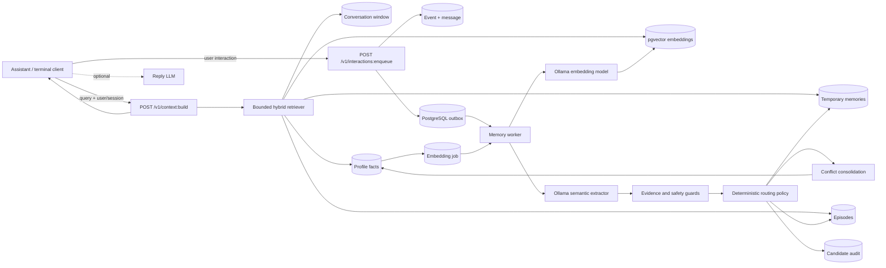

# LLM Memory Service

A standalone memory-management service for an LLM-based elderly home assistant.
It classifies user messages, stores the useful information in the correct memory
scope, retrieves a bounded and relevant context package, and keeps slow model
work outside the conversational response path.

This repository focuses on memory. STT and TTS are intentionally out of scope.
The included chat client is a development harness, not the final assistant.

## Current MVP capabilities

- Structured long-term profile facts in PostgreSQL.
- Append-only episodic memory for bounded past events.
- Independently expiring short-term/session memories.
- A TTL-based sliding conversation window bounded by message and token limits.
- Ollama-based semantic extraction with deterministic policy and evidence guards.
- Automatic deduplication and supersession of conflicting profile slots.
- Asynchronous ingestion through a durable PostgreSQL outbox and worker.
- Persistent 768-dimensional embeddings in PostgreSQL with `pgvector`.
- Hybrid lexical, alias, semantic, recency, confidence, and pinned-category retrieval.
- HNSW cosine index for profile-memory vector search.
- Query-aware and token-bounded context construction.
- Idempotent event and message handling.
- Audit records for extraction decisions.
- A minimal emergency detector; phone calls are simulated only.
- Unit, scenario, model-quality, async, and retrieval benchmark tools.

The user-confirmation workflow has been removed. Explicit health, location, and
emergency-contact statements are stored automatically as `user_asserted`.
Financial identifiers and credentials are discarded. Candidate decisions can
only be `auto_applied` or `ignored`.

`pending` still appears as an asynchronous job status. It means “waiting for a
worker”; it does not mean “waiting for user confirmation.”

## Architecture



### Main technologies and methods

| Component | Technology or method | Purpose |
| --- | --- | --- |
| API | FastAPI + Pydantic | Validated HTTP boundary and OpenAPI documentation |
| Persistence | PostgreSQL + SQLAlchemy | Durable facts, events, messages, jobs, and audit data |
| Schema management | Alembic | Transactional, versioned database migrations |
| Semantic extraction | Ollama, default `gemma4:12b` | Extracts structured meaning; it does not directly choose storage |
| Policy | Deterministic Python policy v3 | Chooses scope, sensitivity handling, TTL, and discard behavior |
| Safety | Literal evidence, number/time/domain guards | Prevents unsupported or inferred memories from being persisted |
| Async processing | Transactional outbox, leases, retries, `SKIP LOCKED` | Keeps extraction latency off the chat response path |
| Long-term retrieval | Lexical overlap + Turkish aliases + semantic score | Finds facts even when the query wording changes |
| Vector search | `pgvector`, cosine distance, HNSW | Fast semantic top-k search as profile data grows |
| Embeddings | Ollama `embeddinggemma:latest`, 768 dimensions | Persistent fact and query vectors |
| Short-term context | TTL items + bounded sliding window | Keeps recent state without unbounded RAM or prompt growth |
| Conflict handling | Canonical category/key slots + similarity | Deduplicates identical facts and supersedes changed values |
| Verification | Python `unittest`, scenario runners, benchmarks | Storage, policy, durability, and latency checks |

## How memory is handled

### 1. Fast ingestion

The recommended endpoint is:

```text
POST /v1/interactions:enqueue
```

It stores the raw user event, conversation message, bounded pre-event context
snapshot, and outbox job in one PostgreSQL transaction. It returns HTTP `202`
without calling the extraction model.

The synchronous endpoint remains available for diagnostics:

```text
POST /v1/interactions:process
```

It waits for extraction and storage, so it is normally much slower.

### 2. Durable worker

The worker claims the oldest eligible job while preserving ordering within the
same user/session. PostgreSQL workers use `FOR UPDATE SKIP LOCKED`, leases, and
bounded exponential retry. A delayed job analyzes the context snapshot captured
when it was enqueued; future messages cannot leak backward into it.

The same worker also processes durable embedding jobs after extraction jobs.

### 3. Semantic extraction

The default Ollama extractor returns structured fields such as:

- whether the text contains a useful assertion;
- literal evidence from the current message;
- subject (`user`, `related_person`, or another party);
- speech act (`preference`, `habit`, `intent`, `episode`, question, and so on);
- temporal scope;
- sensitivity domain;
- proposed category and key.

The model is not trusted to write directly to the database. It also does not
make the final lifetime/storage decision.

### 4. Deterministic evidence and safety policy

Python policy validates model output against the original message. Important
guards include literal-quote checks, question detection, subject attribution,
reported-speech handling, number and time preservation, and protected-domain
overrides.

The resulting storage scopes are:

| Scope | Typical content | Storage behavior |
| --- | --- | --- |
| `profile` | Stable preferences, routines, communication settings, medication routines | One active value per canonical slot; changed values supersede older versions |
| `episode` | A fall, accident, surgery, or other bounded past event | Append-only; does not overwrite profile facts |
| `session` | Current state, today/tomorrow plan, temporary intention | Independent TTL per item |
| `discard` | Questions, greetings, one-off commands, unsupported inference, secrets | Audit decision only; no reusable memory |

Sensitivity is independent from lifetime. For example, a current headache can
be sensitive session memory, a medication routine can be sensitive profile
memory, and a past fall can be a sensitive episode.

Policy summary:

- Explicit health/location/emergency-contact data is stored as
  `verification_status=user_asserted`. This means “the user stated it,” not
  “a clinician or external system verified it.”
- Questions and their presuppositions do not create facts.
- Bare fragments such as `tenis` do not create profile memory.
- Financial identifiers and credentials are not stored as reusable memory.
- No `/confirm`, `/reject`, or confirmation API exists.

### 5. Consolidation

Profile facts are normalized into canonical categories and keys. The
consolidator compares the proposed slot with active memories:

- `create`: no matching slot exists;
- `unchanged`: the same value already exists;
- `supersede`: the same slot has a newer explicit value.

Example: “I play tennis every Saturday at 07:00” followed by “I play tennis
every Saturday at 08:00” produces one active 08:00 fact and retains the old
version as superseded history.

### 6. Embedding pipeline

Every committed active profile fact creates or refreshes a durable embedding
job in the same database transaction. The worker converts the structured fact
text into a 768-dimensional vector with `embeddinggemma:latest` and stores it in
`memory_embeddings`.

The HNSW index is:

```sql
CREATE INDEX ix_memory_embeddings_hnsw_cosine
ON memory_embeddings USING hnsw (embedding vector_cosine_ops);
```

Profile embeddings are persistent. A small in-process LRU cache is used only to
avoid recomputing identical query vectors.

### 7. Query-aware retrieval

`POST /v1/context:build` creates the package that a reply LLM can consume.

Profile candidates are ranked using:

- lexical overlap;
- Turkish/English concept aliases;
- pgvector cosine similarity;
- pinned categories such as communication, accessibility, and emergency contact;
- recency;
- confidence and provenance.

Semantic retrieval has a deterministic lexical/alias fallback if Ollama
embeddings are disabled or unavailable. PostgreSQL may choose a sequential scan
for very small datasets and HNSW for larger ones.

The context package also includes:

- recent active episodes under an item/token budget;
- active temporary memories under an item/token budget;
- unexpired observations;
- the bounded recent conversation suffix;
- memory references and retrieval timing.

### 8. Sliding conversation window

Conversation messages are stored in PostgreSQL, not held only in process RAM.
For each user/session, the service:

1. filters expired messages;
2. orders from newest to oldest;
3. applies `MEMORY_WINDOW_MAX_MESSAGES` and `MEMORY_WINDOW_MAX_TOKENS`;
4. returns the selected messages in chronological order.

With the default `max_messages=10`, message 11 pushes the oldest selected
message out of the context window. The database row remains until its separate
conversation TTL expires.

## Data model

| Table | Role |
| --- | --- |
| `memory_facts` | Versioned long-term profile facts |
| `memory_episodes` | Append-only episodic memories |
| `temporary_memories` | Independently expiring session items |
| `conversation_messages` | TTL conversation history used by the sliding window |
| `session_states` | Explicit session state and temporary observations |
| `memory_events` | Idempotent raw event log |
| `memory_outbox` | Durable async extraction jobs |
| `memory_candidates` | Auto-applied/ignored extraction audit decisions |
| `memory_embeddings` | Persistent profile fact vectors |
| `memory_embedding_jobs` | Durable embedding work queue |

`event_id` and `message_id` are idempotency keys. Reusing an ID with the same
payload returns the existing result; reusing it for different data returns a
conflict. Session ownership checks prevent one `user_id` from reading or writing
another user's session data.

## Prerequisites

- Python 3.11 or newer (the current project has been tested with Python 3.14).
- PostgreSQL.
- The PostgreSQL `pgvector` extension.
- Ollama for real extraction and embeddings.

Example macOS installation:

```bash
brew install postgresql pgvector ollama
brew services start postgresql
createdb memory_db
```

If the Ollama desktop application is already running, do not start a second
server process.

## Installation

```bash
git clone https://github.com/egehankaraca/llm_memory.git
cd llm_memory

python3 -m venv venv
venv/bin/pip install -r requirements.txt

ollama pull embeddinggemma
ollama pull gemma4:12b
```

Load the development environment in every terminal that runs Alembic, the API,
or the worker:

```bash
export DATABASE_URL='postgresql+psycopg2:///memory_db'
export MEMORY_ANALYZER_PROVIDER='ollama'
export OLLAMA_MODEL='gemma4:12b'
export CHAT_OLLAMA_MODEL='gemma4:12b'
export MEMORY_PROFILE_SEMANTIC_PROVIDER='ollama'
export MEMORY_PROFILE_EMBEDDING_MODEL='embeddinggemma:latest'
export MEMORY_ASYNC_INGESTION='true'
```

Environment variables exported in one terminal are not automatically available
in another. Alembic, the API, and the worker must use exactly the same
`DATABASE_URL`. Otherwise code and schema versions can differ and jobs can fail.

Apply all migrations:

```bash
venv/bin/alembic upgrade head
venv/bin/alembic current
```

The expected current revision is the latest `head` shown by Alembic. Migrations
create the `vector` extension, tables, constraints, and HNSW index.

## Running the system

### Recommended: one-command demo

For a local presentation, use the launcher below instead of managing the API
and worker manually:

```bash
venv/bin/python scripts/run_demo.py \
  --database-url 'postgresql+psycopg2:///memory_db' \
  --user-id demo-user-001
```

The launcher checks Ollama and its required models, applies migrations, starts
an isolated API port and asynchronous worker, and opens a concise memory-only
interface. Natural-language input automatically performs retrieval before it
is queued for memory analysis. The launcher waits for extraction and profile
embeddings, so `/status` and `/context` are not needed during the normal demo.

Visible commands are intentionally small:

```text
/profile   Active long-term facts
/session   Active short-term memories
/episodes  Episodic memories
/debug     Toggle detailed output
/help      Show all commands
/exit      Stop the demo, API, and worker
```

If port `8001` is already in use, the launcher selects a free local port. API
and worker logs are kept in a temporary directory and shown only on startup
failure. The conversational reply model, STT, and TTS remain disabled.

To use the same one-command launcher as a real Ollama chat, add `--chat`:

```bash
venv/bin/python scripts/run_demo.py \
  --chat \
  --database-url 'postgresql+psycopg2:///memory_db' \
  --user-id demo-user-001 \
  --model gemma4:12b
```

In chat mode the Conversation Orchestrator retrieves memory before each reply,
passes the bounded context to the reply model, asynchronously enqueues the user
message for memory extraction, and stores the assistant message. API and worker
lifecycle remain owned by the launcher and stop on `/exit`. A new explicit user
correction takes precedence over an older stored value. While the asynchronous
worker is still processing, the active chat keeps a bounded process-local copy
of its latest turns so the very next reply does not fall back to stale memory.
The `--model` value is shared by chat and memory extraction in this launcher.

### Advanced development mode

Use three terminals from the repository root when inspecting each component
separately.

### Terminal 1: API

```bash
export DATABASE_URL='postgresql+psycopg2:///memory_db'
export MEMORY_ANALYZER_PROVIDER='ollama'
export OLLAMA_MODEL='gemma4:12b'
export MEMORY_PROFILE_SEMANTIC_PROVIDER='ollama'
export MEMORY_PROFILE_EMBEDDING_MODEL='embeddinggemma:latest'

venv/bin/alembic upgrade head
venv/bin/uvicorn main:app --reload --port 8001
```

Swagger UI:

```text
http://127.0.0.1:8001/docs
```

### Terminal 2: worker

Use the same database and model settings:

```bash
export DATABASE_URL='postgresql+psycopg2:///memory_db'
export MEMORY_ANALYZER_PROVIDER='ollama'
export OLLAMA_MODEL='gemma4:12b'
export MEMORY_PROFILE_SEMANTIC_PROVIDER='ollama'
export MEMORY_PROFILE_EMBEDDING_MODEL='embeddinggemma:latest'

venv/bin/python scripts/run_memory_worker.py
```

### Terminal 3: memory-only demo

This is the recommended project demo. It does not call a conversational reply
model, STT, or TTS.

```bash
venv/bin/python scripts/run_memory_terminal_demo.py \
  --user-id demo-user-001 \
  --session-id demo-session-001 \
  --debug
```

Available commands:

```text
/context [query]  Build and show the bounded query-aware context
/memories         List active long-term profile facts
/episodes         List episodic memories
/temporary        List active short-term/session memories
/status EVENT_ID  Show an async job and its eventual decisions
/help             Show commands
/exit             Exit
```

Any other input is sent only to the Memory Service.

Suggested demo inputs:

```text
Bana bundan sonra Ahmet Bey diye hitap et.
Her sabah bol köpüklü Türk kahvesi içerim.
Tansiyon ilacımı her sabah saat 8'de alırım.
Bugün öğleden sonra yürüyüşe çıkmak istiyorum.
Dün banyoda düştüm.
Bugün hava nasıl?
```

Expected routing:

- form of address and coffee preference → profile;
- medication routine → protected `user_asserted` profile;
- today's walk → session memory with TTL;
- yesterday's fall → episode;
- weather question → ignored/discarded.

Because ingestion is asynchronous, copy the returned event ID and wait for:

```text
/status EVENT_ID
```

The final job state should be `completed`. Model extraction may take several
seconds even though enqueue normally returns in milliseconds.

## Optional chat demo

The chat demo requests memory context, calls an Ollama reply model, stores the
assistant message, and enqueues memory extraction in the background:

```bash
venv/bin/python scripts/run_chat_demo.py \
  --user-id chat-user-001 \
  --session-id chat-session-001 \
  --debug
```

The local demo uses `gemma4:12b` for both conversational replies and memory
extraction so one generative model stays resident. The small
`embeddinggemma:latest` embedding model remains separate. Poor conversational
wording does not by itself prove a retrieval failure; inspect
`profile_fact_count`, `/context`, and `/status`.

The bounded emergency orchestrator detects high-signal bleeding, breathing,
consciousness, chest-pain, head-impact/fall, stroke-warning, seizure, and
explicit-help patterns. It can use up to four recent user messages for a short
follow-up such as a post-fall symptom, rejects historical/negated fall and head
impact statements, and retrieves a verified emergency contact only for an
emergency-domain query. It never places a real call; the demo reports
`call_simulated`.

## Direct API examples

### Enqueue one interaction

```bash
EVENT_ID=$(uuidgen | tr '[:upper:]' '[:lower:]')

curl -sS -X POST http://127.0.0.1:8001/v1/interactions:enqueue \
  -H 'Content-Type: application/json' \
  -d "{\"event_id\":\"$EVENT_ID\",\"user_id\":\"ahmet-001\",\"session_id\":\"session-001\",\"text\":\"Makarna yemeyi çok severim\"}" \
  | python3 -m json.tool --no-ensure-ascii
```

### Inspect the eventual result

```bash
curl -sS \
  "http://127.0.0.1:8001/v1/interactions/$EVENT_ID/status?user_id=ahmet-001" \
  | python3 -m json.tool --no-ensure-ascii
```

### Build context for a later query

```bash
curl -sS -X POST http://127.0.0.1:8001/v1/context:build \
  -H 'Content-Type: application/json' \
  -d '{
    "user_id": "ahmet-001",
    "session_id": "session-002",
    "query": "Akşam ne yemek yapsam?"
  }' | python3 -m json.tool --no-ensure-ascii
```

The pasta preference should appear in `profile_facts` after the async job and
embedding job have completed. Lexical/alias retrieval can still select it while
an embedding is temporarily missing.

### List active profile facts

```bash
curl -sS http://127.0.0.1:8001/v1/users/ahmet-001/memories \
  | python3 -m json.tool --no-ensure-ascii
```

### Check embedding coverage

```bash
curl -sS 'http://127.0.0.1:8001/v1/embeddings/status?user_id=ahmet-001' \
  | python3 -m json.tool --no-ensure-ascii
```

### Forget a profile memory

```bash
curl -i -X DELETE \
  'http://127.0.0.1:8001/v1/memories/MEMORY_ID?user_id=ahmet-001'
```

Deleting a fact also removes its embedding through the database foreign key.

## API overview

| Method | Endpoint | Purpose |
| --- | --- | --- |
| `GET` | `/healthz` | Service health |
| `GET` | `/v1/analyzer/status` | Extractor/model availability |
| `GET` | `/v1/embeddings/status` | Embedding coverage and queue health |
| `POST` | `/v1/interactions:enqueue` | Recommended asynchronous ingestion |
| `GET` | `/v1/interactions/{event_id}/status` | Job and decision status |
| `POST` | `/v1/interactions:process` | Synchronous diagnostic ingestion |
| `POST` | `/v1/context:build` | Query-aware bounded context |
| `POST/GET` | `/v1/sessions/{session_id}/messages` | Append/list conversation history |
| `POST` | `/v1/temporary-memories` | Trusted explicit temporary write |
| `GET` | `/v1/sessions/{session_id}/temporary-memories` | Active temporary items |
| `POST` | `/v1/memories` | Trusted explicit profile fact write |
| `GET` | `/v1/users/{user_id}/memories` | Profile fact listing |
| `GET` | `/v1/users/{user_id}/episodes` | Episode listing |
| `POST` | `/v1/events` | Explicit idempotent event append |
| `PUT` | `/v1/sessions/{session_id}/state` | Explicit session state update |
| `GET` | `/v1/candidates` | Extraction audit listing |
| `DELETE` | `/v1/memories/{memory_id}` | Delete one profile fact |
| `DELETE` | `/v1/episodes/{episode_id}` | Delete one episode |
| `DELETE` | `/v1/sessions/{session_id}` | Delete session-scoped state/history |

## Embedding backfill

Queue embeddings for facts created before the vector pipeline existed:

```bash
venv/bin/python scripts/backfill_memory_embeddings.py
```

For one user:

```bash
venv/bin/python scripts/backfill_memory_embeddings.py --user-id ahmet-001
```

Keep the worker running until `/v1/embeddings/status` reports
`missing_count: 0`.

## Tests and evaluation

### Unit and integration-style tests

The automated suite uses isolated SQLite databases and mocked model calls. It
does not modify the configured PostgreSQL database:

```bash
venv/bin/python -m unittest discover -s tests
```

At the time of writing, the suite contains 295 passing tests.

### Real-model memory evaluation

The curated Turkish datasets are:

```text
evals/memory_cases.jsonl
evals/memory_regressions.jsonl
```

Run a small smoke set without database writes:

```bash
venv/bin/python scripts/run_memory_evals.py \
  --case long_001 \
  --case short_001 \
  --case sensitive_001 \
  --case discard_001 \
  --show-passed
```

Run the complete set:

```bash
venv/bin/python scripts/run_memory_evals.py \
  --json-report evals/latest_memory_report.json
```

### End-to-end memory scenarios

Storage only:

```bash
venv/bin/python scripts/run_memory_scenarios.py \
  --json-report evals/latest_storage_scenarios.json
```

Storage plus real Ollama extraction:

```bash
venv/bin/python scripts/run_memory_scenarios.py \
  --with-analyzer \
  --json-report evals/latest_analyzer_scenarios.json
```

These runners create isolated synthetic IDs but leave records in the API's
database. Use a development database, not production.

### Consolidation demo

```bash
venv/bin/python scripts/run_consolidation_demo.py
```

It demonstrates create, unchanged, and automatic supersession behavior.

### Async enqueue and durability benchmark

Stop the worker, keep the API running, and enqueue a batch:

```bash
venv/bin/python scripts/run_async_memory_benchmark.py enqueue \
  --requests 20 \
  --users 5 \
  --concurrency 10 \
  --report evals/async_outbox_benchmark.json
```

Inspect without waiting:

```bash
venv/bin/python scripts/run_async_memory_benchmark.py inspect \
  --report evals/async_outbox_benchmark.json \
  --expect-unfinished
```

Start the worker, then wait for completion:

```bash
venv/bin/python scripts/run_async_memory_benchmark.py drain \
  --report evals/async_outbox_benchmark.json \
  --timeout-seconds 600
```

### Retrieval benchmark

This seeds synthetic 768-dimensional vectors, measures HNSW/planner behavior and
exact cosine search, and removes the rows unless `--keep-data` is used:

```bash
venv/bin/python scripts/run_retrieval_benchmark.py \
  --sizes 1000 10000 \
  --queries 100 \
  --top-k 20 \
  --with-ollama \
  --json-report evals/retrieval_benchmark.json
```

The benchmark excludes the final reply LLM. It reports vector search and query
embedding latency separately.

## Configuration

See `.env.example`. Important variables:

| Variable | Default | Purpose |
| --- | --- | --- |
| `DATABASE_URL` | `postgresql+psycopg2:///memory_db` | PostgreSQL connection used by Alembic, API, and worker |
| `MEMORY_SERVICE_URL` | `http://127.0.0.1:8001` | Demo client's Memory Service URL |
| `MEMORY_ASYNC_INGESTION` | `true` | Use the outbox fast path in demos |
| `MEMORY_ANALYZER_PROVIDER` | `ollama` | `ollama` or deterministic `rules` fallback mode |
| `OLLAMA_BASE_URL` | `http://127.0.0.1:11434` | Local Ollama API |
| `OLLAMA_MODEL` | `gemma4:12b` | Shared memory extraction and default reply model |
| `OLLAMA_TIMEOUT_SECONDS` | `30` | Extraction timeout |
| `OLLAMA_KEEP_ALIVE` | `5m` | Extractor residency |
| `OLLAMA_NUM_CTX` | `4096` | Extractor context size |
| `CHAT_OLLAMA_MODEL` | `gemma4:12b` | Optional explicit reply-model override; keep equal to `OLLAMA_MODEL` for single-model mode |
| `MEMORY_TIMEZONE` | `Europe/Istanbul` | Today/tomorrow TTL calculations |
| `MEMORY_OUTBOX_MAX_ATTEMPTS` | `5` | Extraction job attempt limit |
| `MEMORY_WINDOW_MAX_MESSAGES` | `10` | Sliding-window message limit |
| `MEMORY_WINDOW_MAX_TOKENS` | `2000` | Sliding-window approximate token budget |
| `MEMORY_CONVERSATION_TTL_HOURS` | `24` | Raw conversation message lifetime |
| `MEMORY_TEMPORARY_MAX_ITEMS` | `20` | Temporary-memory context item limit |
| `MEMORY_TEMPORARY_MAX_TOKENS` | `1500` | Temporary-memory context budget |
| `MEMORY_TEMPORARY_TTL_MINUTES` | `60` | Default session-state TTL |
| `MEMORY_PROFILE_MAX_FACTS` | `20` | Profile facts returned per context |
| `MEMORY_PROFILE_MAX_TOKENS` | `1500` | Profile context token budget |
| `MEMORY_PROFILE_PINNED_CATEGORIES` | communication/accessibility | Always-considered categories; protected health and emergency facts require a matching query domain |
| `MEMORY_EPISODE_MAX_ITEMS` | `10` | Episode item limit |
| `MEMORY_EPISODE_MAX_TOKENS` | `1000` | Episode token budget |
| `MEMORY_PROFILE_SEMANTIC_PROVIDER` | `none` in code | Set to `ollama` for pgvector retrieval |
| `MEMORY_PROFILE_EMBEDDING_MODEL` | `embeddinggemma:latest` | 768-dimensional embedding model |
| `MEMORY_PROFILE_SEMANTIC_MIN_SIMILARITY` | `0.40` | Semantic candidate threshold |
| `MEMORY_PROFILE_VECTOR_TOP_K` | `20` | Maximum pgvector neighbors |
| `MEMORY_EMBEDDING_MAX_ATTEMPTS` | `5` | Embedding job attempt limit |
| `MEMORY_SEMANTIC_RETRY` | `false` | Optional second extraction attempt; slower |

Chat demo settings use the `CHAT_OLLAMA_*` variables in `.env.example` and are
independent of memory extraction settings.

## Troubleshooting

### `Address already in use`

Another process owns port 8001:

```bash
lsof -nP -iTCP:8001 -sTCP:LISTEN
```

Stop that process or select another port and pass the matching
`--memory-url`/`MEMORY_SERVICE_URL`.

### `zsh: command not found: GET`

`GET /path` is API notation, not a shell command. Use `curl`:

```bash
curl -sS http://127.0.0.1:8001/healthz
```

### Shell shows `dquote>`

The command contains an unmatched quote, often an apostrophe inside a
single-quoted JSON string. Press `Ctrl+C`, then use a typographic apostrophe,
escape the JSON correctly, or place the payload in a file.

### Jobs stay `pending`

The worker is not running, is using a different database, or is still processing
the model call. Start `scripts/run_memory_worker.py` with the same
`DATABASE_URL`, then inspect `/status EVENT_ID`.

### Jobs become `failed` after a schema change

Check the database selected in every terminal:

```bash
echo "$DATABASE_URL"
venv/bin/alembic current
venv/bin/alembic upgrade head
```

Restart the API and worker after migrations. A failed old job is terminal; resend
the user statement with a new event ID.

### Embeddings are missing

```bash
venv/bin/python scripts/backfill_memory_embeddings.py
curl -sS http://127.0.0.1:8001/v1/embeddings/status
```

Keep the worker and Ollama running until the embedding queue completes.

### Ollama is unavailable

```bash
curl -sS http://127.0.0.1:11434/api/tags
ollama list
```

The Memory Service can fall back to deterministic rules, but real-model quality
tests intentionally report a fallback as a model failure.

## Project layout

```text
main.py                         FastAPI service and storage routing
models.py                       SQLAlchemy data model
memory_analyzer.py              Ollama extraction, policy, and guards
memory_consolidator.py          Deduplication and supersession
memory_outbox.py                Durable extraction queue primitives
memory_worker.py                Extraction and embedding worker
memory_embeddings.py            Persistent pgvector pipeline
memory_retriever.py             Bounded hybrid ranking
profile_semantic.py             Ollama embedding client and query cache
conversation_orchestrator.py    Optional HTTP-only chat coordinator
emergency_orchestrator.py       Minimal simulated emergency action layer
alembic/versions/               Database migrations
scripts/                        Demos, workers, evals, and benchmarks
evals/                          Curated datasets and experiment reports
tests/                          Automated test suite
```

## Security and production limitations

This is a local-development MVP, not a production medical or emergency system.

- The API currently uses caller-supplied `user_id`; add real authentication and
  authorization before network exposure.
- The application does not add field-level encryption. Use encrypted transport,
  encrypted storage, secret management, and restricted database access.
- Raw events, candidate audits, and conversation messages may contain personal
  data. Define retention, deletion, and legal-consent policies for deployment.
- Financial identifiers and credentials are discarded by policy, but the guards
  are not a comprehensive DLP product.
- `user_asserted` data has not been externally verified.
- Emergency actions are simulated. Real calling/device integrations require a
  separate safety-reviewed tool layer, explicit operational policy, monitoring,
  and regional compliance.
- The optional reply model can still generate awkward or incorrect language.
  Memory extraction, retrieval, and final response quality must be evaluated
  separately.
